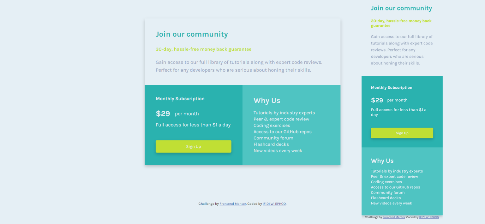
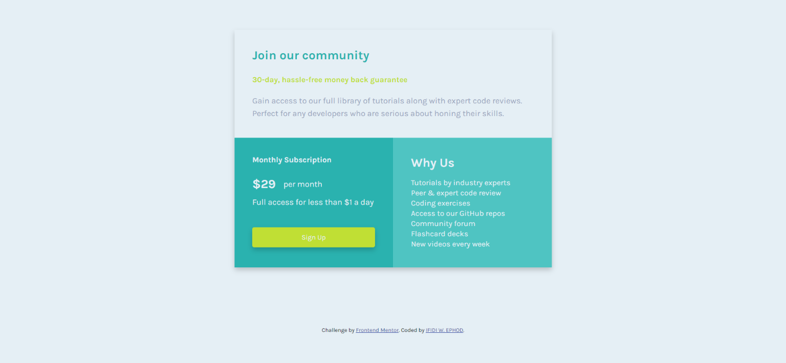

# Frontend Mentor - Single price grid component solution

This is a solution to the [Single price grid component challenge on Frontend Mentor](https://www.frontendmentor.io/challenges/single-price-grid-component-5ce41129d0ff452fec5abbbc). Frontend Mentor challenges help you improve your coding skills by building realistic projects.

## Table of contents

- [Overview](#overview)
  - [The challenge](#the-challenge)
  - [Screenshot](#screenshot)
  - [Links](#links)
- [My process](#my-process)
  - [Built with](#built-with)
  - [What I learned](#what-i-learned)
  - [Continued development](#continued-development)
  - [Useful resources](#useful-resources)
- [Author](#author)
- [Acknowledgments](#acknowledgments)

## Overview

This is a design of a single price grid to check the knowledge of the student on flexbox or grid manipulation.

### The challenge

The challenge was to test the student on his/her html and CSS level of manipulation.

Users should be able to:

- View the optimal layout for the component depending on their device's screen size
- See a hover state on desktop for the Sign Up call-to-action

### Screenshot





### Links

- Solution URL: [https://github.com/winsofttutorials/single-price-grid-component-master.git]
- Live Site URL: [https://winsofttutorials.github.io/single-price-grid-component-master/]

## My process

After carefully going through the requirements for this challenge, I had to check for the best approach to this and I decided to go with the grid.

### Built with

- Semantic HTML5 markup
- CSS custom properties
- Flexbox
- CSS Grid
- Mobile-first workflow
- [React](https://reactjs.org/) - JS library
- [Next.js](https://nextjs.org/) - React framework
- [Styled Components](https://styled-components.com/) - For styles

### What I learned

I learnt to understand the media query more for the smaller screen size.

To see how you can add code snippets, see below:

```html
<h1>Some HTML code I'm proud of</h1>
```

```css
.proud-of-this-css {
  color: papayawhip;
}
```

```js
const proudOfThisFunc = () => {
  console.log("🎉");
};
```

If you want more help with writing markdown, we'd recommend checking out [The Markdown Guide](https://www.markdownguide.org/) to learn more.

### Continued development

Adding some active events on the component and try to create the next-btn

### Useful resources

- [Example resource 1](https://www.example.com) - This helped me for XYZ reason. I really liked this pattern and will use it going forward.
- [Example resource 2](https://www.example.com) - This is an amazing article which helped me finally understand XYZ. I'd recommend it to anyone still learning this concept.

## Author

- Website - [https://winsofttutorials.github.io/single-price-grid-component-master/]
- Frontend Mentor - [@winsofttutorials](https://www.frontendmentor.io/profile/winsofttutorials)
- Twitter - [@IFIDIKUROEPHOD](https://www.twitter.com/IFIDIKUROEPHOD)

## Acknowledgments

Gratitude to @frontendmentor for this challenge and also to my mentor @Avinash who is an inspiration to me.
